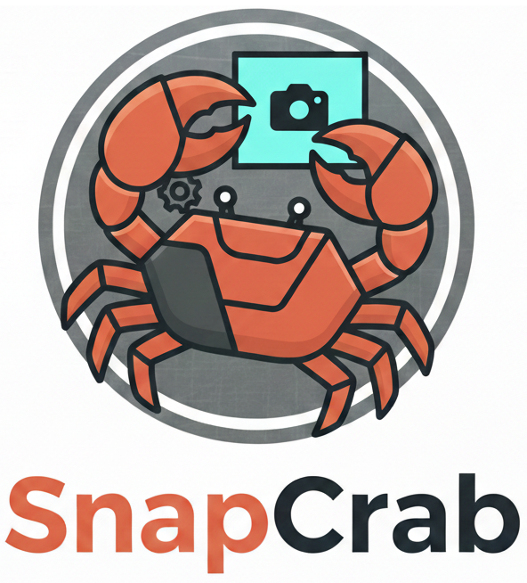

# SnapCrab 🦀



A lightweight, high-performance screenshot and annotation tool for Windows, built with Rust and egui.

The name is a pun on **Snapchat** (keeping the GenZ hype alive), **Screenshot** (taking a "snap"), and **Crab** (celebrating Rust and its mascot, Ferris).

## What is SnapCrab?

SnapCrab allows you to capture your screen, individual windows, or specific areas and instantly annotate them. It is a portable, single-binary utility designed for speed and simplicity.

## Features

- **Native Capture:** High-quality screenshots using native Windows APIs.
- **Interactive Selection:** Capture fullscreen, specific windows (with hover highlighting), or custom rectangular areas.
- **Layer Management:** Manage annotations via a side panel—move, delete, or select individual elements.
- **High DPI Support:** Sharp UI on all displays.

## How to Use

1. **Capture:** Click the "📸 Capture" menu and choose a mode (Fullscreen, Select Window, or Select Area).
2. **Annotate:** Select a tool (Arrow, Box, Text) and draw directly on the image. Use the Layers panel to manage your drawings.
3. **Export:** Click "📋 Copy" to put the image in your clipboard, or "💾 Save" to export as a PNG.

## Building from Source

### Prerequisites

- [Rust](https://rustup.rs/) toolchain.
- `cargo-xwin` and `devenv` (for Linux cross-compilation).

### Build Command

```bash
cargo xwin build --target x86_64-pc-windows-msvc --release
```

The executable will be located at `target/x86_64-pc-windows-msvc/release/snapcrab.exe`.
